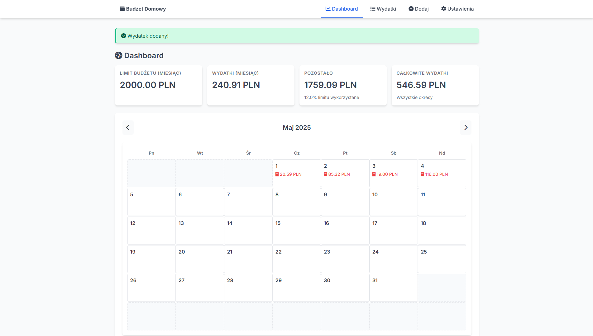
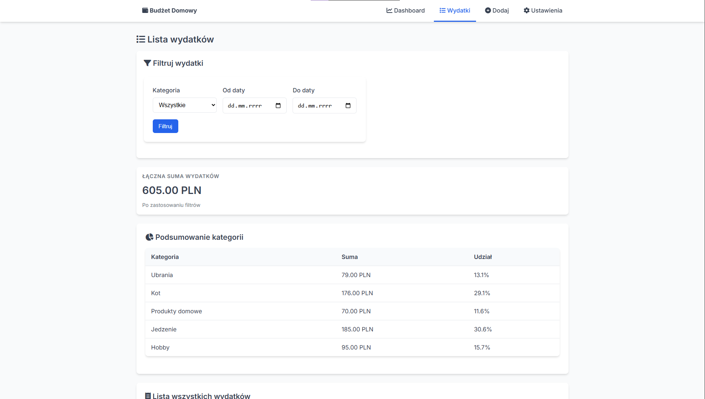
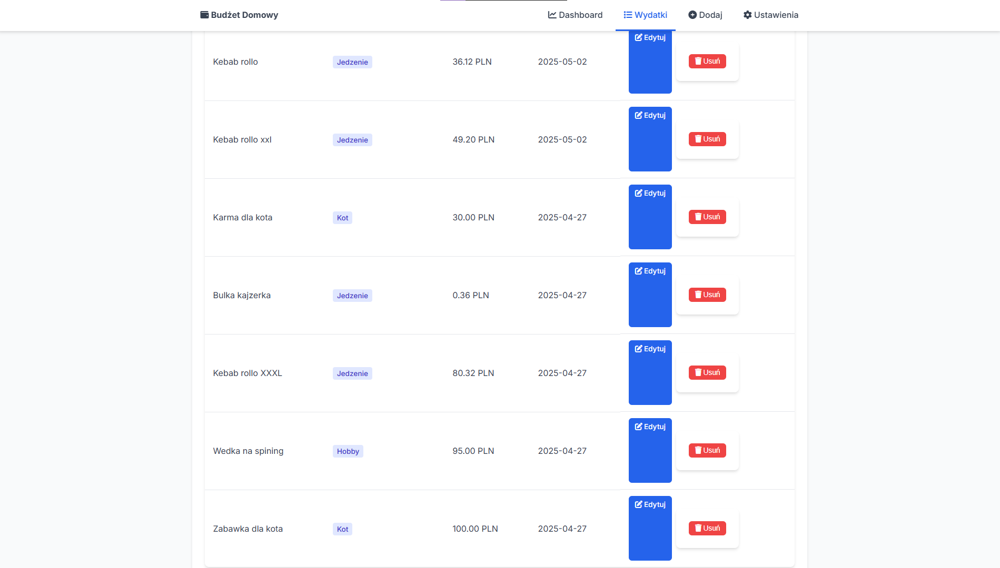
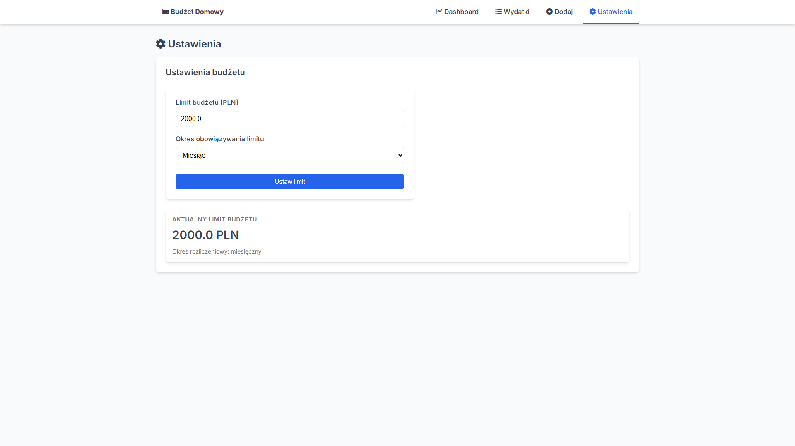

# Budget app 📈- Aplikacja do zarządzania wydatkami
Aplikacja Budget app to narzędzie do śledzenia wydatków domowych z możliwością ustawiania limitów budżetowych, kategoryzowania wydatków oraz przeglądu historii finansów z wykorzystaniem przejrzystego kalendarza.

## Funkcje

- 📊 Dashboard z przejrzystym podsumowaniem wydatków
- 📅 Kalendarz wydatków miesięcznych
- 💰 Limity budżetowe z możliwością ustawienia okresu (tydzień/miesiąc/rok)
- 📋 Kategoryzacja wydatków dla lepszej organizacji
- 🔍 Filtrowanie wydatków według kategorii i dat
- 📧 Powiadomienia e-mail o przekroczeniu limitu budżetu
- 📱 Responsywny interfejs działający na różnych urządzeniach

## Zrzuty ekranu działania aplikacji



<table>
  <tr>
    <td align="center">
      <br/>
      <sub>Memo Cards – menu</sub>
    </td>
    <td align="center">
      <br/>
      <sub>Memo Cards – plansza</sub>
    </td>
    <td align="center">
      <br/>
      <sub>Memo Cards – wygrana</sub>
    </td>
  </tr>
</table>


## Technologie

- Flask - framework aplikacji webowej
- SQLAlchemy - ORM do obsługi bazy danych
- WTForms - obsługa formularzy
- SQLite - lekka baza danych
- HTML/CSS - front-end aplikacji

## Struktura projektu

- app.py - główny plik aplikacji z trasami
- models.py - definicje modeli danych
- forms.py - formularze Flask-WTF
- templates/ - szablony HTML
- static/ - style CSS
- instance/ - lokalna baza danych SQLite (tworzona automatycznie)
- migration_db.py - skrypt migracji bazy danych

## Instalacja i uruchomienie
Poniżej znajduje się krok po kroku instrukcja, jak uruchomić aplikację na swoim komputerze:
### Wymagania wstępne
- Python 3.8+ zainstalowany na komputerze
- Dostęp do terminala/wiersza poleceń

## Kroki instalacji
1. Pobierz repozytorium
```
git clone https://github.com/FranekChabr/Portfolio.git
cd BudgetApp
```

2. Utwórz wirtualne środowisko Python
```
bashpython -m venv venv
```

3. Aktywuj wirtualne środowisko *(najbezpieczniej)*
- Windows:
```
bashvenv\Scripts\activate
```
- macOS/Linux:
```
bashsource venv/bin/activate
```

4. Zainstaluj wymagane pakiety
```
bashpip install -r requirements.txt
```

5. Uruchom migrację bazy danych
```
bashpython migration_db.py
```

6. Uruchom aplikację
```
bashpython app.py
```
7. Otwórz przeglądarkę i przejdź pod adres http://127.0.0.1:5000

## Rozwój aplikacji
Możliwości dalszego rozwoju aplikacji:

- Dodanie wykresów i statystyk wydatków
- Implementacja systemu użytkowników i logowania
- Eksport/import danych do plików CSV/Excel
- Dodanie planowanych wydatków/przychodów

### Autor
Franciszek Chabros 
franekchabr@gmail.com
