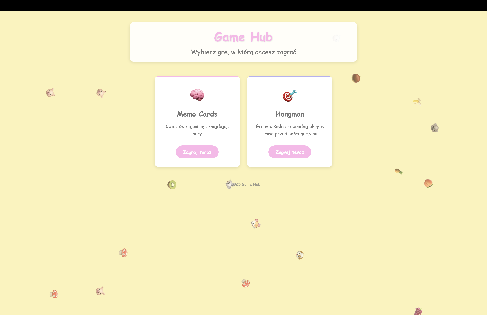
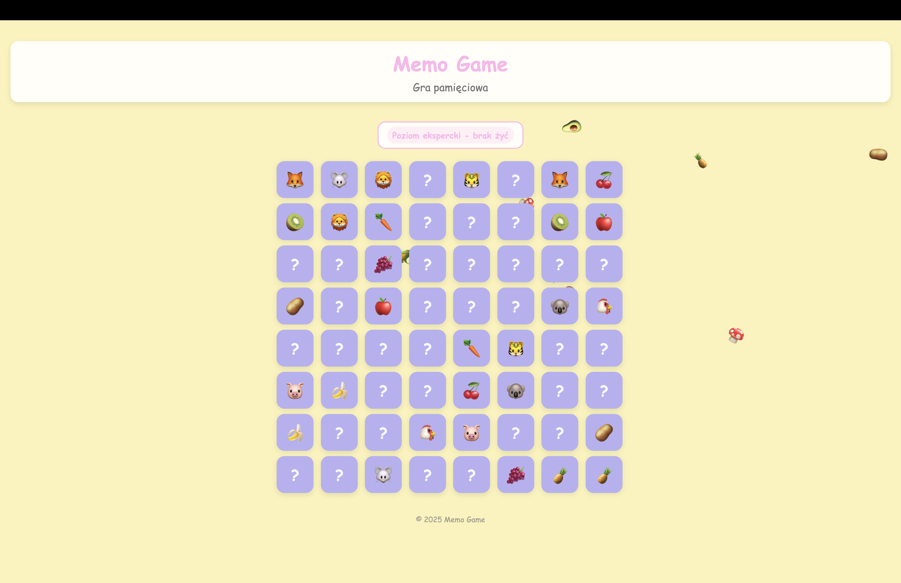
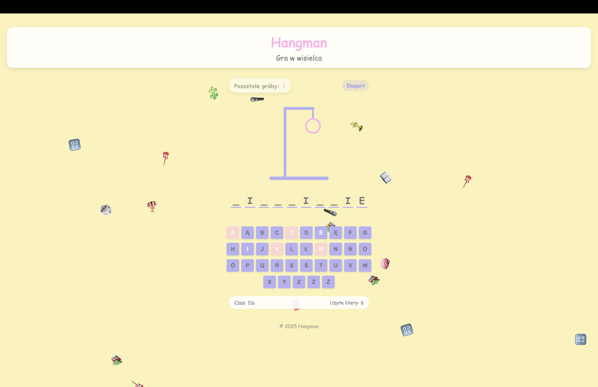
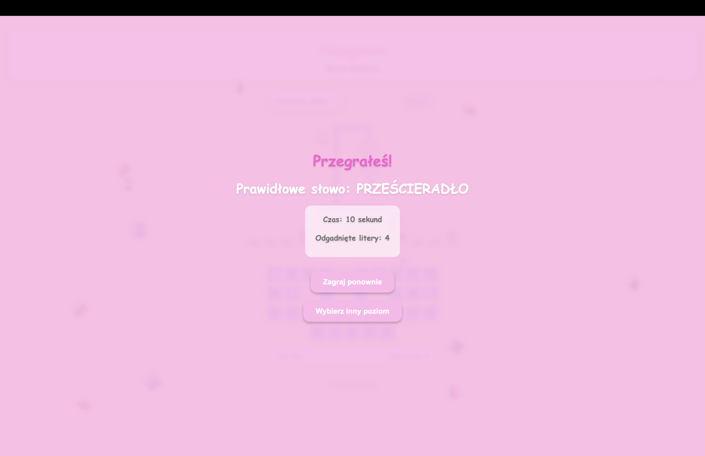

# Game Hub 🎮 – Zbiór gier webowych

**Game Hub** to zbiór dwóch klasycznych gier stworzonych w czystym HTML, CSS i JavaScript. Projekt służy zarówno jako portfolio frontendowe, jak i przyjemna rozrywka online.

## 🎮 Zawarte gry

### 🧠 Memo Cards – Gra pamięciowa

Gra polega na odnajdywaniu par kart:

- Wybierz poziom trudności (od 2x2 do 8x8).
- Znajdź wszystkie pary przy jak najmniejszej liczbie pomyłek.
- Na większości plansz obowiązuje limit serduszek (błędów).
- Ostatnia plansza (8x8) nie ma limitu serduszek.
- Po ukończeniu poziomu gra zaproponuje przejście na trudniejszy.

### 🔤 Hangman – Wisielec

Klasyczna gra słowna:

- Odgadnij słowo, zanim pojawi się cały wisielec.
- 5 błędnych liter powoduje przegraną.
- Stopniowo odkrywana jest animowana postać wisielca.

## Zrzuty ekranu działania aplikacji



<table>
  <tr>
    <td align="center">
      <br/>
      <sub>Memo game</sub>
    </td>
    <td align="center">
      <br/>
      <sub>hangman</sub>
    </td>
    <td align="center">
      <br/>
      <sub>przegrana</sub>
    </td>
  </tr>
</table>

## 🔊 Dźwięki

Obie gry posiadają efekty dźwiękowe znajdujące się w katalogu `assets/sounds/`. Dźwięki odtwarzane są przy:

- poprawnych ruchach,
- błędach,
- wygranej i przegranej.

## 📁 Struktura projektu

- `home.html` – strona główna z wyborem gry  
- `memo/` – folder z grą Memo Cards  
- `hangman/` – folder z grą Hangman  
- `assets/` – obrazy i dźwięki wykorzystywane w grach  
- `css/` – arkusze stylów CSS  

## 🚀 Jak uruchomić?

1. Sklonuj repozytorium:

   ```bash
   git clone https://github.com/FranekChabr/Portfolio.git
   cd Portfolio/Gamehub
   ```
2. Otwórz plik home.html w przeglądarce 

## Technologie
- Vanilla JavaScript
- HTML5
- CSS3

## Możliwości rozwoju
- Dodanie opcji zapisywania wyników (localStorage) 
- Ranking graczy (top score)
- Dostosowanie motywu graficznego (np. dark mode)
- Dodanie trzeciej gry do kolekcji

### Autor
Franciszek Chabros franekchabr@gmail.com
